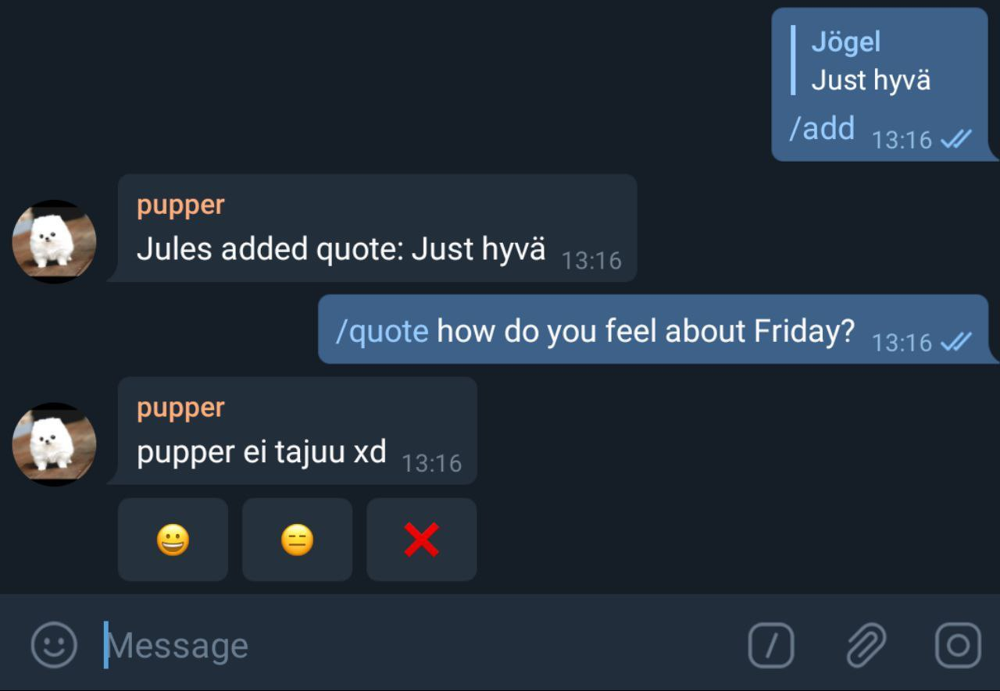

## Julius Uusinarkaus - stuff I've gone and done. 

### TKO-älys Freshman Pass 
(Ruby on Rails)

Done mostly with [ZHarrowed](https://github.com/zHarrowed)

[Github](https://github.com/TKOaly/freshman-pass-service)

An electronic fresher pass service, where new students can see upcoming events, and log past events or various tasks for points. Tutors can also give freshers extra points (hidden or public). Everybody has a profile picture, making it easier to recognise new students and tutors. 

The service has wildly increased fresher activity in events, as well as made it easier for students to recognise and interact with tutors. 

### PUPPER - Telegram quote bot 

[Github](https://github.com/julkku/telegram-quote-bot)

Add it to a group! Add quotes! Ask quotes! Confirmation bias makes it seem like pupper is a mega-intelligent AI. It's amazing. Pupper can save text with basic markdown, voice messages and Telegram stickers. When you ask for a /quote, it searches first, if it doesn't find anything it sends a random quote from the chat. The first user to press a vote button gets to vote on it, votes control how often the quote comes up. 

  
   

  

Quotes returned is smaller than quotes requested because when I created pupper it was a little too popular and I needed to add a time buffer. Anyway, this is the stats for a single group, so pupper has survived pretty vigourously out in the wild. 

### My responsive sitsi-songbook
(Node/angular)

[Try it](https://asplaulut.herokuapp.com/) // [Github](https://github.com/julkku/songbook-webapp)

This was my first web project, made it in an afternoon on the day of a table party in need of an electronic song book. It's pretty nifty in actual use - and has been in heavy use! 

  
   
  

### BONUS

#### This Harry Potter -inspired clock 

You know that clock in the Weasleys living room that shows where everyone in the family is? I made one of those that works with IFTTT or something. 

[Github](https://github.com/julkku/weasley-clock) // [Here it is](https://julkku.github.io/weasley-clock/clockweb/)

#### [I made this school project look nice and sparkly](https://dtt-lukuvinkkikirjasto.herokuapp.com/)

