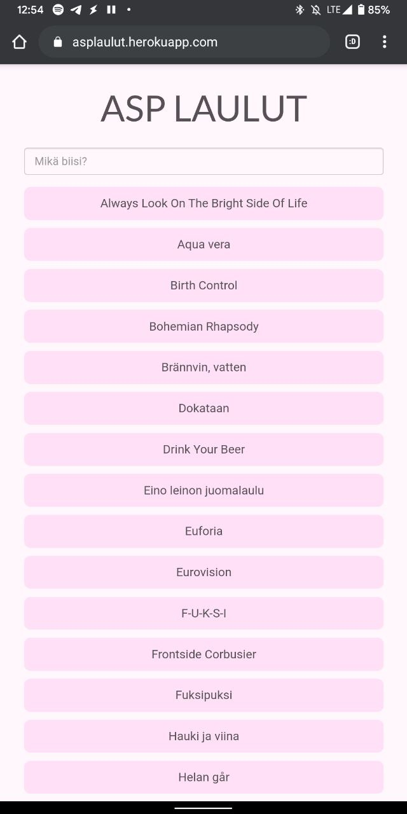
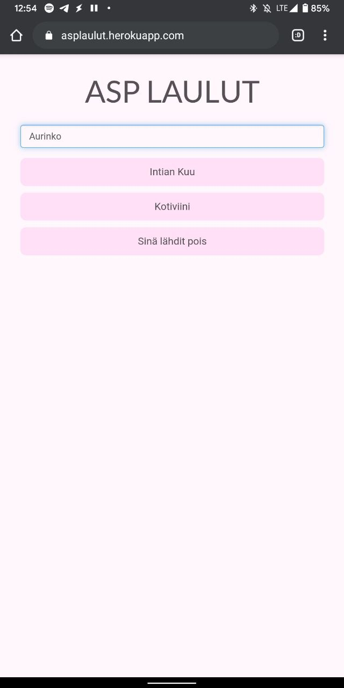
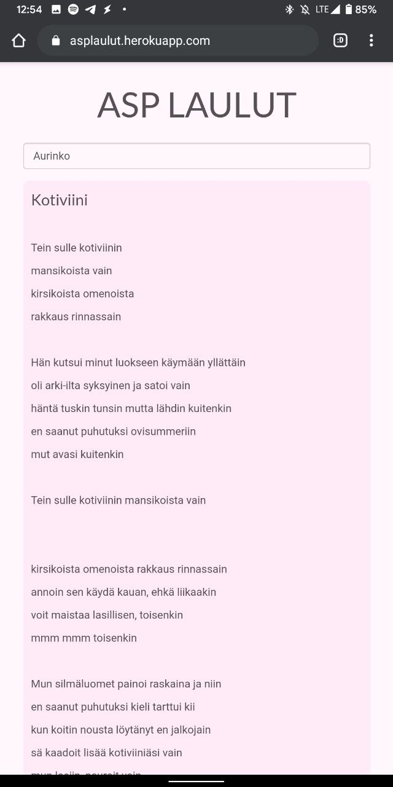

## Julius Uusinarkaus - stuff I've done. 

### My responsive sitsi-songbook
(Node/angular)

[Try it](https://asplaulut.herokuapp.com/) // [Github](https://github.com/julkku/songbook-webapp)

This was my first web project, made it in an afternoon on the day of a table party in need of an electronic song book. It's pretty nifty in actual use - and has been in heavy use! 

### TKO-älys Freshman Pass 
(Ruby on Rails)

Done mostly with [ZHarrowed](https://github.com/zHarrowed)

[Github](https://github.com/TKOaly/freshman-pass-service)

An electronic fresher pass service, where new students can see upcoming events, and log past events or various tasks for points. Tutors can also give freshers extra points (hidden or public). Everybody has a profile picture, making it easier to recognise new students and tutors. 

The service has wildly increased fresher activity in events, as well as made it easier for students to recognise and interact with tutors. 

